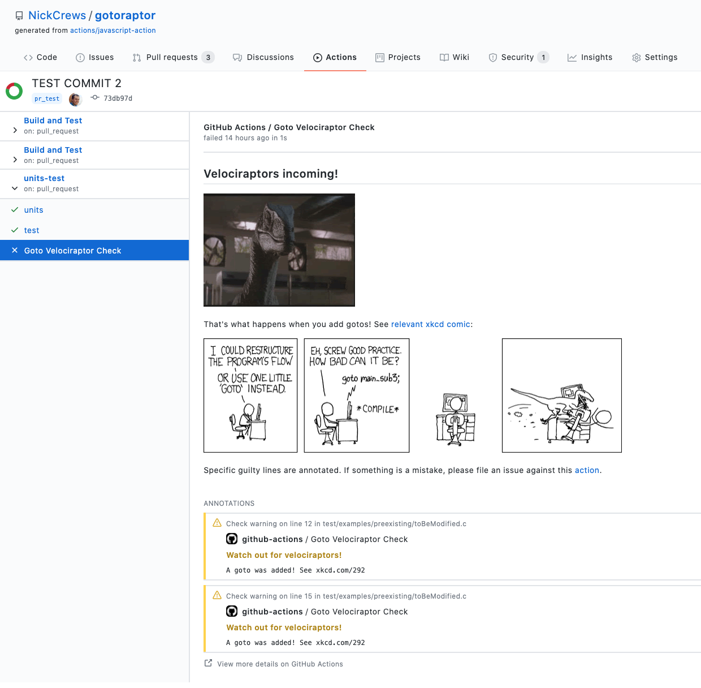

# GoTo Velociraptor Check


So you thought no one would notice that one little `goto` you added? Watch out!
This action is always watching, and will send velociraptors to anyone is
foolish enough to try to sneak one in. Inspired by the [xkcd comic *goto*](https://xkcd.com/292):

<p align="center">
  <a href="https://xkcd.com/292">
    
  </a>
</p>

## Usage

You can use the action by adding this step to your project's
[workflow yaml](https://docs.github.com/actions/quickstart):

```yaml
name: Lint
on: [pull_request, push]
jobs:
    name: Goto Velociraptor Check
    steps:
      # Checking out the repo is NOT required
      # - uses: actions/checkout@v2
      - uses: NickCrews/gotoraptor@v1
```

If the action finds any gotos were added, then the PR or push commit gets
flagged. The action looks through all added or modified lines in `.cs`, `.c`,
`.cpp`,`.h`, and `.hpp` files, using a simple regex to find `goto` statements.
This isn't perfect, and might result in some false
positives and false negatives. A more complete method would be to actually
compile the code and parse the syntax tree, but I found this not feasible:
This action couldn't possibly know exactly how your project is compiled,
what compiler flags are used, etc.

In the screenshot below you can see what the action does when it finds an
added goto. Of note are the velociraptor memes, the xckd comic, and
annotations on specific lines:



See the [actions tab](https://github.com/NickCrews/gotoraptor/actions) for example runs of this action! :rocket:
